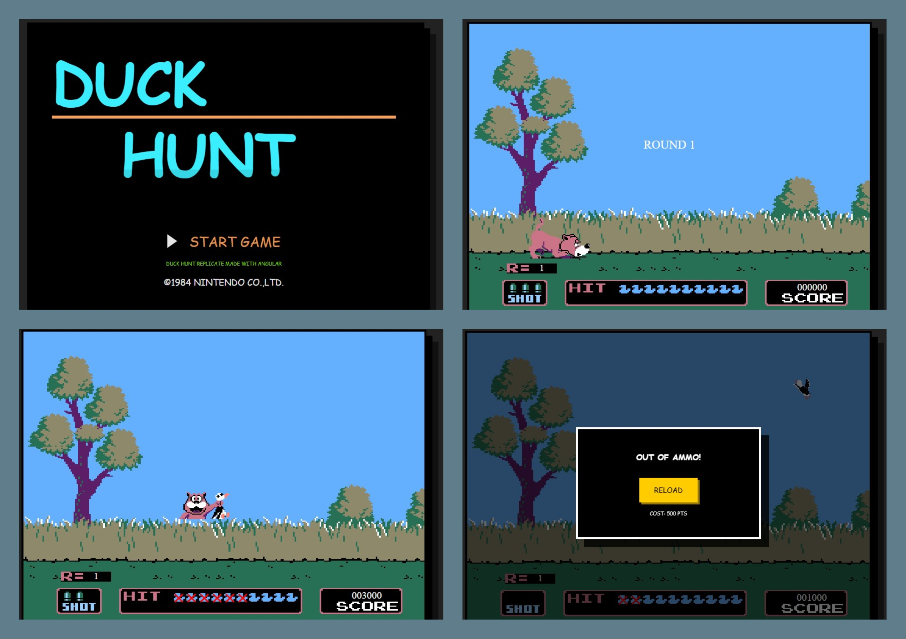

<div align="center">
  <br />
    <a>
      
    </a>

  <br />
  <h3 align="center">Duck hunt</h3>
</div>

## <a name="table">Table of Contents</a>

1. [Introduction](#introduction)
2. [Project Structure](#project-structure)
3. [Quick Start](#quick-start)


## <a name="introduction">Introduction</a>

This project is a recreation of the 1984 NES classic. It utilizes Angular for component orchestration and HTML5 Canvas for high-performance rendering, ensuring a smooth 60FPS experience.


## <a name="project-structure">Project Structure</a>

```bash
duck-hunt/
├── src/
│   ├── main.ts
│   ├── index.html
│   ├── styles.scss
│   ├── favicon.ico
│   ├── app/
│   │   ├── app.config.ts
│   │   ├── app.component.ts
│   │   ├── app.component.scss
│   │   ├── app.component.html
│   │   ├── core/
│   │   │   ├── audio.service.ts
│   │   │   ├── state.service.ts
│   │   │   └── engine.service.ts
│   │   ├── components/
│   │   │   ├── game-board/
│   │   │   ├── scoreboard/
│   │   │   └── intro-screen/
│   │   ├── models/
│   │   │   ├── constant.ts
│   │   │   ├── dog.model.ts
│   │   │   └── duck.model.ts
│   └── assets/
│       ├── sfx/
│       └── sprites/
├── angular.json
└── package.json
```

## <a name="quick-start">Quick Start</a>

```bash
# Clone the Repository
git clone https://github.com/sdulal412/duck-hunt.git
cd duck-hunt

# Install dependencies (only the first time)
npm install

# Runs the local on http://localhost:4200
ng serve

# Build the project (output path: dist/duck-hunt)
ng build
```
